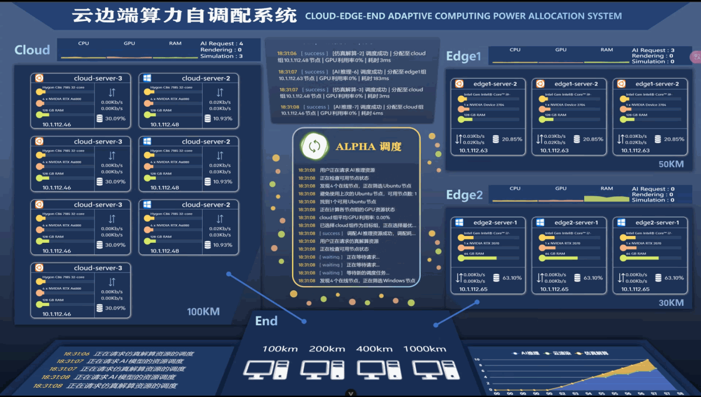

# Self-Allocation — 云边端算力自调配系统

## 项目简介

Self-Allocation 是一个 **云边端算力资源自调配系统** ，用于在边缘计算和云计算场景下，对多台服务器的算力资源进行统一调度和动态分配。系统由一个 **调度服务器（后端）** 、一个 **可视化监控面板（前端）**和部署在各节点上的 **监控代理程序（Node Agent）** 组成，通过 WebSocket 实时通信实现节点状态采集、任务下发与负载均衡。

## 演示视频



https://github.com/user-attachments/assets/show.mp4

> 如果视频无法加载，请下载根目录下的 [show.mp4](./show.mp4) 观看。

## 项目架构


## 技术框架

### 前端（self-allocation-front）

| 技术 | 说明 |
|------|------|
| Vue 3 | 前端核心框架 |
| Vite 6 | 构建工具与开发服务器 |
| Element Plus | UI 组件库 |
| Pinia | 状态管理 |
| Vue Router | 路由管理 |
| ECharts | 数据可视化图表 |
| Axios | HTTP 请求库 |
| Sass | CSS 预处理器 |
| ESLint + Prettier | 代码规范 & 格式化 |
| pnpm | 包管理器 |

### 后端（self-allocation-back）

| 技术 | 说明 |
|------|------|
| Node.js + Express | 后端服务框架 |
| Socket.IO | 与前端 / 节点的实时通信 |
| Axios | 向外部服务转发请求 |
| js-yaml | YAML 配置文件解析 |
| Winston | 日志管理（按日期轮转） |
| CORS | 跨域支持 |
| nodemon | 开发热重载 |

### 节点代理（self-allocation-node）

| 技术 | 说明 |
|------|------|
| Node.js | 运行时环境 |
| Socket.IO Client | 与调度服务器通信 |
| systeminformation | 采集系统硬件指标（CPU、GPU、内存、磁盘、网络） |
| Winston | 日志管理 |
| js-yaml / yaml | 配置文件解析 |

## 主要用途

- **AI 推理调度**：接收用户的 AI 推理请求，根据各节点负载情况将请求路由到合适的云 / 边缘节点上的 Ollama 服务
- **云渲染调度**：对接平行云管理中心，将云渲染任务分配到合适的节点
- **仿真解算调度**：将仿真计算任务动态分发到算力充足的节点
- **实时监控**：通过 WebSocket 实时采集各节点的 CPU、GPU、内存、磁盘、网络等硬件指标，在前端 Dashboard 进行可视化展示
- **负载均衡**：支持优先级调度（priority）和负载均衡（load balancing）两种调度策略，可在配置文件中切换

## 环境要求

| 依赖 | 版本要求 |
|------|---------|
| Node.js | >= 18.x（推荐 LTS 版本） |
| pnpm | >= 8.x（前端包管理器） |
| npm | >= 9.x（后端 & 节点包管理器） |
| Git | 最新稳定版 |

> **注意**：项目不依赖传统数据库，所有状态在内存中管理，配置通过 YAML 文件完成。

## 快速开始

### 1. 克隆项目

```bash
git clone https://github.com/Xiao-Taner/Computing-Power-Self-Allocation-System.git
cd Computing-Power-Self-Allocation-System
```

### 2. 启动前端

```bash
cd self-allocation-front
pnpm install
pnpm dev
```

前端开发服务器默认运行在 `http://localhost:5173`。

### 3. 启动后端调度服务器

```bash
cd self-allocation-back
npm install
npm run dev
```

后端服务将启动以下端口：
- API 服务：`3100`
- Socket 服务：`3000`
- 用户请求服务：`3200`

> 启动前请根据实际环境修改 `self-allocation-back/config/default.yaml` 中的 IP 地址和端口配置。

### 4. 启动节点代理（在每台云 / 边缘节点上执行）

```bash
cd self-allocation-node
npm install
npm start
```

> 启动前请根据实际节点信息修改 `self-allocation-node/config/node-config.yaml` 中的配置。

## 项目目录结构

```
SELF-ALLOCATION/
├── self-allocation-front/    # 前端 - Vue 3 可视化监控面板
│   ├── src/
│   │   ├── api/              # 接口请求封装
│   │   ├── components/       # 页面组件
│   │   ├── router/           # 路由配置
│   │   ├── stores/           # Pinia 状态管理
│   │   ├── utils/            # 工具函数（WebSocket、请求封装等）
│   │   └── views/            # 页面视图
│   ├── package.json
│   └── vite.config.js
│
├── self-allocation-back/     # 后端 - 调度服务器
│   ├── config/               # YAML 配置文件（服务器、节点、调度策略）
│   ├── routes/               # Express 路由
│   ├── scheduler/            # 调度器核心逻辑（策略、节点状态）
│   ├── services/             # 业务服务（Ollama、渲染、仿真）
│   ├── socket/               # Socket.IO 通信管理
│   ├── utils/                # 工具函数（日志、错误处理）
│   └── package.json
│
├── self-allocation-node/     # 节点代理 - 部署在云 / 边缘设备上
│   ├── collectors/           # 系统指标采集器
│   ├── config/               # 节点配置
│   ├── socket/               # Socket 客户端通信
│   ├── utils/                # 工具函数
│   └── package.json
│
├── .gitignore
└── README.md
```

## 配置说明

### 后端配置（self-allocation-back/config/default.yaml）

- `server` — 服务器地址和端口配置
- `external_services` — 外部服务地址（Ollama、平行云等）
- `scheduler` — 调度策略（priority / load）、超时、健康检查间隔
- `task_priority` — 任务类型优先级
- `node_weights` — 云 / 边缘节点处理不同任务的权重
- `monitoring` — 监控指标采集间隔和数据保留天数

### 节点配置（self-allocation-node/config/node-config.yaml）

- 节点名称、类型（cloud / edge）
- 调度服务器连接地址
- 心跳间隔等参数
